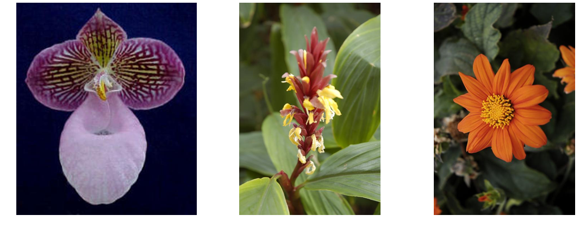
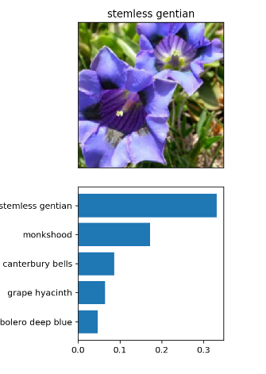
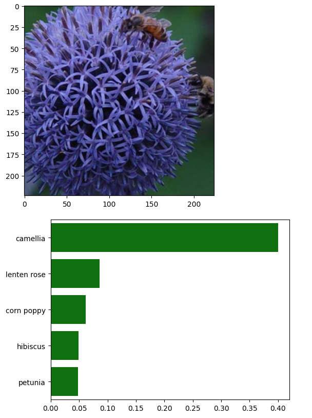

# AI Programming with Python Project

## Description:
This project is a command-line-based deep learning image classifier built using PyTorch. It classifies flower images into different categories using transfer learning. Users can choose between pre-trained architectures (VGG13 or DenseNet121), fine-tune a custom classifier on top, and train using GPU if available. Once trained, the model is saved as a checkpoint for future inference.

## Features:

- Trains an image classifier using a dataset organized in train/valid/test subdirectories.

- Supports two transfer learning architectures: VGG13 and DenseNet121.

- Allows command-line customization of training hyperparameters.

- Can run on GPU for faster training (if available).

- Saves the trained model as a PyTorch checkpoint.

## Usage Overview:

The training script accepts various command-line arguments to specify data location, architecture, and hyperparameters.

## Required:
A dataset folder containing train, valid, and test subfolders.

## Parameters:
data_dir – Path to dataset folder

--save_dir – Path to save the model checkpoint (default is current directory)

--arch – Model architecture (vgg13 or densenet121)

--learning_rate – Learning rate for training

--hidden_units – Number of hidden units in the custom classifier

--epochs – Number of training epochs

--gpu – Use GPU for training (if available)

--optimizer – Optimizer to use (adam is default)

--criterion – Loss function (default is negative log likelihood)

## Model Structure:

Uses a pre-trained CNN (VGG13 or DenseNet121) as the feature extractor.

Freezes the convolutional base.

Adds a custom fully connected classifier for flower prediction (102 classes).

Trained using Negative Log Likelihood Loss and the Adam optimizer.

## Input Format:

Dataset folder with images organized by class:

bash
Copy
Edit
data_dir/
  train/
    class1/
    class2/
    ...
  valid/
  test/

## Workflow:

Load and transform data using torchvision.transforms.

Initialize a pre-trained model and replace its classifier.

Train the model and validate at intervals.

Save the model checkpoint to the desired location.

## Dependencies:

Python 3.x

PyTorch

Torchvision

NumPy

argparse

torchvision.datasets (ImageFolder)

## Inferences

